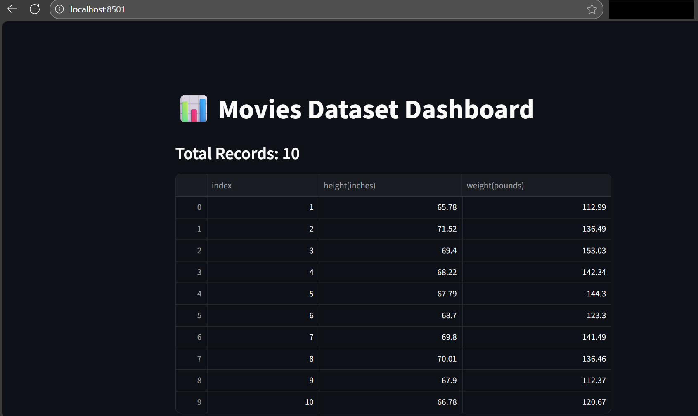
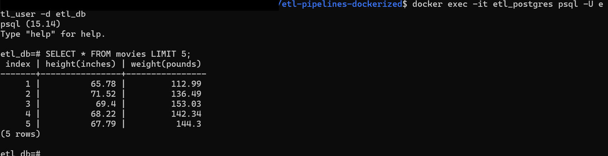

# ETL Pipelines (Dockerized)


---

# ETL Pipelines Dockerized

This project demonstrates a full ETL pipeline running in Docker, with a Postgres database backend and a Streamlit dashboard for visualization. The ETL process extracts data, transforms it, and loads it into a Postgres database. A Streamlit app then queries this database and displays key insights such as record counts, top N rows, and simple charts.

## Quickstart

1. Make sure Docker Desktop is installed and running.
2. In the project root, start all services using Docker Compose:

```bash
docker compose up --build
```

This will start three services: `etl` (Python ETL pipeline), `db` (Postgres), and `streamlit` (dashboard).

---

## 1. Streamlit Dashboard

Once the services are running, open a browser and navigate to `http://localhost:8501` to view the Streamlit dashboard.



The dashboard shows top records, charts, and summary metrics from the ETL-loaded database.

---

## 2. Database Verification

To verify the data is correctly loaded into Postgres, open a new terminal (while Docker is running) and connect to the database:

```bash
docker exec -it etl_postgres psql -U etl_user -d etl_db
```

Run a sample SQL query to inspect the first few rows:

```sql
SELECT * FROM movies LIMIT 5;
```



This confirms that the ETL pipeline successfully inserted data into the `movies` table.

---

## Project Structure

* `etl/` → Python scripts for ETL and dashboard
* `tests/` → Unit tests for ETL functions
* `docker-compose.yml` → Docker services definition
* `requirements.txt` → Python dependencies for production
* `requirements-dev.txt` → Python dependencies for development and CI/CD

---

## CI/CD

GitHub Actions automatically lint, test, and build Docker images on every push to the repository. Status badges are displayed in the README to indicate pipeline health.

---

## Next Steps / TODOs

* Add incremental data loads
* Integrate Airflow for scheduling
* Enhance Streamlit dashboard with interactive charts

---


